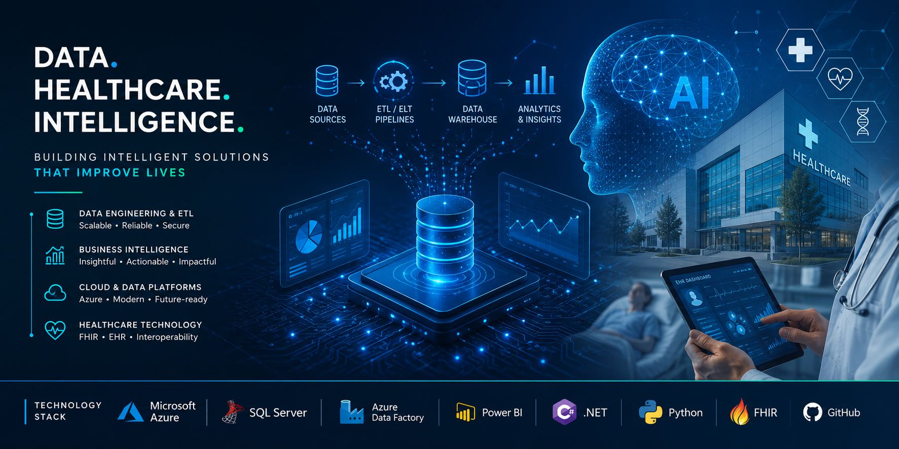

### 🚀 Data Platform Engineer | Business Systems Integration| Cybersecurity | AI

My work sits at the intersection of **data engineering, cybersecurity, digital transformation, and business systems integration**, with a strong focus on building platforms that are:
- 🔐 Secure by design
- 📊 Data-driven and insight-focused
- 🏥 Interoperable and healthcare-ready
- ⚙️ Automated, scalable, and maintainable
- 🛡️ Aligned with governance, risk, and compliance principles

I enjoy insights into modern data platforms, enterprise applications, and business solutions that combine engineering discipline, security principles, and innovative technologies.

### 🚀 What I'm Working On
- 🔄 Building metadata-driven ETL frameworks with Airflow, Python, PowerShell, SQL Server & Azure.
- 🤖 Exploring AI solutions for smarter decision-making and automation.
- 📊 Developing BI solutions with Power BI, SQL Server & Azure.
- ☁️ Learning Cloud Engineering, DevOps, Containers & Infrastructure Automation.
- 🌐 Designing scalable, resilient, interoperable, AI-ready enterprise architectures.
- 📚 Exploring AI, Cybersecurity & Modern Data Engineering.
- 🎵 Building a PowerShell music library cleaner for deduplication and organisation.
- 🏗️ Building cloud-native data platforms with scalable ETL/ELT pipelines.

## 💻 My Tech Stack & Toolkit
#### Languages & Frameworks
- C# / .NET / ASP.NET Core
- PowerShell (Automation & System Scripting)
- SQL Server • Azure • Power BI • Azure Data Factory (ETL/ELT) • SSIS Integration
- Apache Airflow • AI • Data Engineering
- Data Governance • Risk Management • Cybersecurity • Compliance
- DevOps • Docker

## 🛠️ Current Projects

### MusicLibCleaner

A PowerShell-based music library management tool that scans audio collections, identifies duplicates, organises files, and classifies music for a cleaner, more manageable library.

➡️ **Repository:** [github.com/Purplewells/MusicLibCleaner](https://github.com/Purplewells/MusicLibCleaner)

### 🏥 Healthcare Information Platform
Designing a modern healthcare ecosystem focused on:
- Patient-centred workflows
- Clinical data management
- Healthcare interoperability
- Secure multi-tenant architecture

### ⚙️ Metadata-driven ETL Framework
Building scalable data pipelines using:
- Apache Airflow
- SQL Server
- Python
- PowerShell
- Metadata-based transformation rules

### 🔐 Security Engineering Research
Exploring:
- Threat modelling
- Security architecture
- Incident response
- AI cybersecurity applications

  ## 🎵 Featured Project

